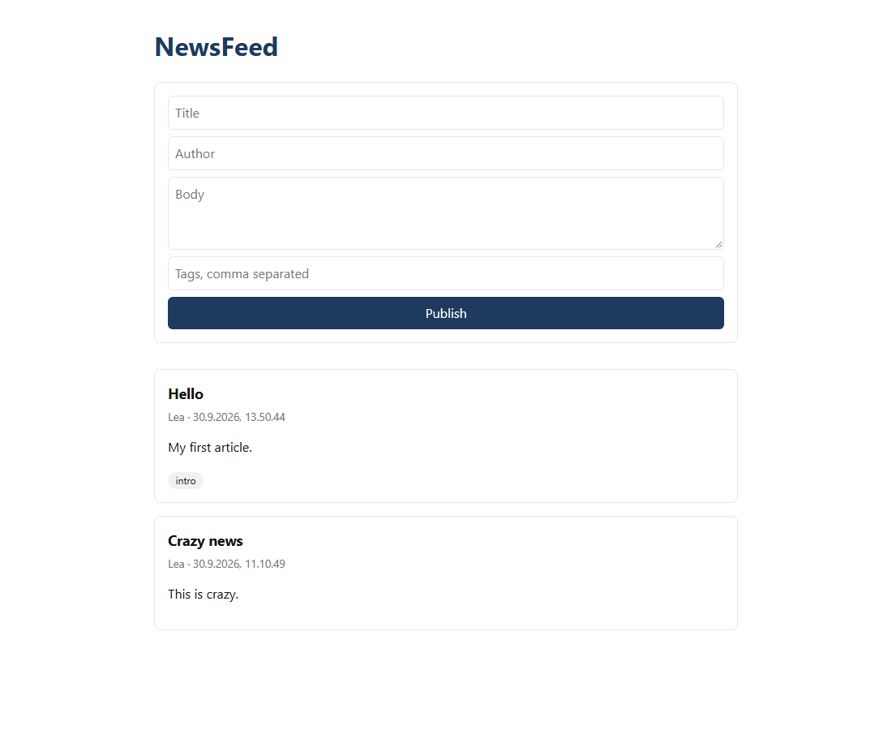
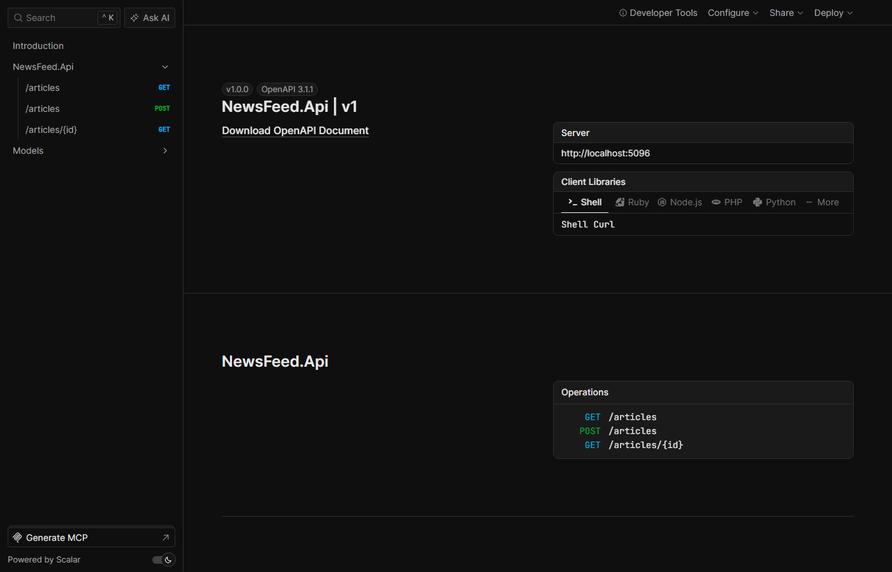

# NewsFeed API

A small news feed app: a C# / ASP.NET Core REST API with PostgreSQL and a simple web page.

  
  

.## Features

- REST API to create, list and retrieve articles
- PostgreSQL persistence with Entity Framework Core migrations
- HTML/JavaScript front end and interactive API docs (OpenAPI + Scalar)

**Tech stack:** C#, ASP.NET Core (.NET 10), Entity Framework Core, PostgreSQL, JavaScript

## API

| Method | Endpoint | Description |
|---|---|---|
| `GET` | `/articles` | List articles, newest first |
| `GET` | `/articles/{id}` | Get an article (`404` if not found) |
| `POST` | `/articles` | Create an article (`201 Created`) |

## Getting started

Requires the [.NET 10 SDK](https://dotnet.microsoft.com/download), [PostgreSQL](https://www.postgresql.org/download/) and the EF Core CLI (`dotnet tool install --global dotnet-ef`).

1. Set the PostgreSQL credentials in `NewsFeed.Api/appsettings.Development.json`.
2. `dotnet ef database update --project NewsFeed.Api`
3. `dotnet run --project NewsFeed.Api`, then open http://localhost:5096 (API docs at `/scalar`).

## Lessons learned

<!-- Write 2-4 sentences yourself. For example: what surprised you coming from Python,
     what was hard (EF Core migrations? dependency injection?), and how you used AI tools.
     Only write what is true for this project. -->

I used AI-assisted development throughout, working in small, verifiable steps: one change at a time, reviewed before moving on.

## Roadmap

Input validation · xUnit tests · CI with GitHub Actions · Docker Compose
